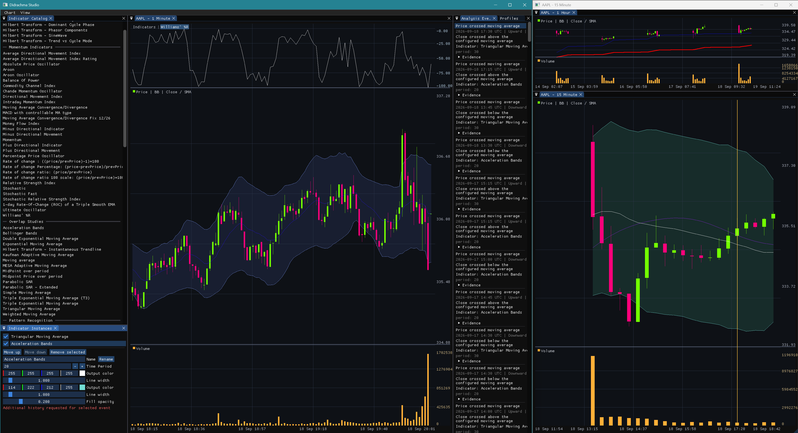

# Didrachma

Didrachma is an ongoing, from-scratch rebuild of a stock-market analysis application.

Years ago, I spent several months building the original version around a Windows GDI+ charting stack. The project was eventually shelved, but the idea never disappeared. With AI-assisted development, the foundation has now been rebuilt over a weekend as a modern C++20 application with a cross-platform OpenGL architecture and focused external libraries.

> [!IMPORTANT]
> Didrachma is under active development. APIs, file formats, UI workflows, and module boundaries may still change. It is not yet intended for production trading or financial decision-making.



## Current state

The current repository already provides:
- OHLC candlestick charts with a linked volume pane
- multi-chart Didrachma Studio with ImGui docking
- Yahoo Finance history and polling support
- provider-neutral bars, timeframes, history requests, and live-update semantics
- configurable TA-Lib indicator instances with typed parameters
- price-overlay, volume, and separate indicator panels
- analysis conditions and timestamped Analysis Events
- navigation from an Analysis Event back to the relevant chart position
- reusable indicator profiles and workspace persistence
- explicit forming-versus-closed bar handling
- deterministic offline tests for the market, analysis, chart, and Studio core modules.

The application can already calculate and render indicators and derive analysis events from their configured instances. Pattern recognition, strategy execution, data pipelines, and risk management are the next major stages.

## Design direction

Didrachma separates market data, analysis, chart state, rendering, and application UI:

| Area | Responsibility |
| --- | --- |
| `market/core` | Provider-neutral bars, series, timeframes, revisions, queues, and resampling |
| `market/providers/yahoo` | Yahoo Finance history and polling adapter |
| `analysis/core` | Indicator contracts, conditions, events, and multi-timeframe alignment |
| `analysis/adapters/talib` | TA-Lib catalog discovery and indicator calculation |
| `stockChart/core` | Chart documents, layers, profiles, navigation, and selection |
| `stockChart/render` | OpenGL/ScopeCanvas chart geometry, rendering, caching, and invalidation |
| `studio/core` | UI-independent workspace, session, event, and persistence orchestration |
| `apps/studio` | ImGui docking shell and interactive Studio panels |
| `apps/chart` | Earlier ImPlot/Yahoo chart application retained as a regression reference |

The domain modules remain independent of ImGui and OpenGL. Providers publish data updates through explicit queues, while chart rendering and GPU resources remain owned by the UI/render thread.

## Third-party libraries

The main external libraries used or planned are:

| Library | Role | Status |
| --- | --- | --- |
| Dear ImGui | Docking UI and Studio panels | In use |
| ImPlot | Plotting support for the earlier chart application | In use |
| TA-Lib | Technical indicators and candlestick pattern recognition | Indicators in use; patterns in progress |
| nlohmann/json | Profile, workspace, and future strategy serialization | In use |
| libcurl | HTTP transport for market-data providers | In use |
| QuantLib | Option valuation and risk-management calculations | Planned |

Supporting dependencies currently include GLFW, GLAD, GLM, and CLI11. ScopeCanvas provides the reusable OpenGL canvas/rendering foundation used by Didrachma Studio.

Each dependency remains subject to its own license and distribution terms.

## Upcoming goals

### TA-Lib pattern recognition

- Select candlestick-pattern definitions from the indicator catalog.
- Mark confirmed patterns directly on the price chart.
- Publish matching entries in Analysis Events.
- Commit patterns only when their timeframe bar is closed, preventing a forming live bar from repainting an already-confirmed result.

### Strategy engine using TA-Lib analysis

- Build reusable strategies from market data, indicators, patterns, and ordered or simultaneous conditions.
- Combine several timeframes of the same instrument with fixed sector, index, or peer instruments.
- Track entry, duration, stop-loss, provisional target, return, and exit conditions.
- Allow runtime rules to tighten a stop or adjust a target as market conditions change.
- Use the same deterministic engine in Studio and in a CLI11 backtest application.

### Data pipelines

- Add durable historical and live-data ingestion pipelines.
- Share normalized series between charts, indicators, strategies, and tests.
- Extend beyond the current Yahoo Finance adapter without coupling the domain model to one provider.
- Add persistent storage for longer histories and repeatable analysis.

### Risk management with QuantLib

- Model shares, cash, options, and combined positions.
- Calculate profit/loss, exposure, option value, and in-the-money state.
- Evaluate stop-loss, coverage, and adjustment scenarios.
- Connect strategy results to portfolio-level risk without placing broker orders from the analysis core.

## Building

Didrachma uses CMake and C++20. The current primary development environment is Windows/MSVC, while the code and rendering architecture are being kept portable.

Clone the repository with its submodules and configure a separate build directory:

```console
git clone --recurse-submodules <repository-url>
cd Didrachma
cmake -S . -B build -DDidrachma_BUILD_TESTS=ON
cmake --build build --config Release
ctest --test-dir build -C Release --output-on-failure
```

The dependency layer first tries configured local CMake packages and otherwise uses the repository's reviewed fallback definitions. The first configuration may therefore need network access when local packages are unavailable.

## Project status

Didrachma is a personal research and engineering project. The immediate focus is correctness, reproducible analysis, closed-bar semantics, and testable module boundaries.

Issues, documentation, and public contribution guidance will be added as the project stabilizes.

## License

No project license has been selected yet.

This repository is publicly available, but public visibility does not grant permission to use, modify, or redistribute the source code. A license will be added once the project’s licensing terms have been decided.

Third-party components remain subject to their respective licenses.

